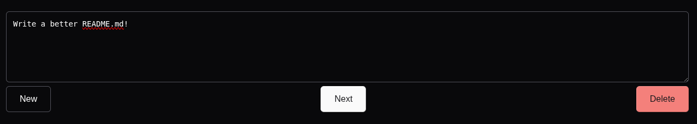

# Pipe

A minimalistic pipeline for your tasks!



## Usage

### Nix

```nix
# flake.nix
inputs = {
  pipe = {
    url = "github:juliuskreutz/pipe";
    inputs.nixpkgs.follows = "nixpkgs";
  };
}

# configuration.nix
imports = [
  inputs.pipe.nixosModules.pipe
];

systemd.tmpfiles.rules = [ "d /etc/pipe 0755 root root" ];

services.pipe = {
  enable = true;
  port = 3000; # default
  databaseUrl = "file:/etc/pipe/db.sqlite";
};
```

### Manual

You need to install [pnpm](https://pnpm.io), [nodejs](https://nodejs.org) and [sqlite](https://sqlite.org)

```sh
git clone git@github.com:juliuskreutz/pipe && cd pipe
pnpm i
pnpm run dev # for dev
pnpm run build && DATABASE_URL=file:db.sqlite node .output/server/index.mjs # for prod
```

The `drizzle` folder needs to be in the same directory where you call `node ...`!